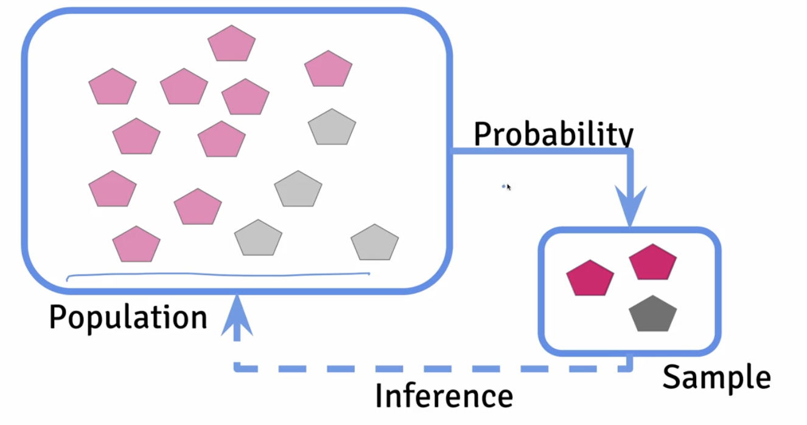
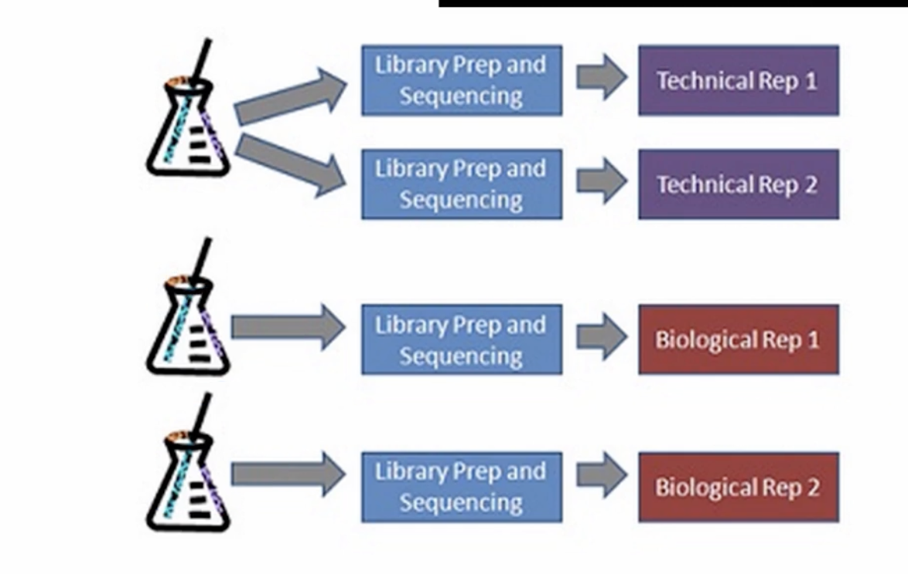

### Experimental Design: Variability, Replication, and Power

  

***3 Major Source of Variability in Most Genomic Measurement***: 
1: Phenotypic variability
2: Measurment error
3: Natural biological variation

--- 

***How do you measure those types of variability:
2 big types of replicate meaning you do an expereiment more than one.*** 

  

Replicates in Genomic 
  Research: Technical vs. 
  Biological

Replication is essential in experiments because no measurement is perfectly accurate — errors can come either from the measurement process itself (like pipetting, sequencing, or machine sensitivity) or from natural biological differences between samples. Replicates help us tell these two sources of variation apart, making our results more reliable and meaningful.

There are two main types of replication. Technical replicates are repeated measurements on the same biological sample. They help reveal variability introduced by the experimental process or the equipment. For example, taking RNA from the same tissue sample and sequencing it multiple times shows how consistent the machine is. Biological replicates, on the other hand, are measurements from different biological sources — such as samples from different people, organisms, or tissues. These capture the natural variability in biology itself, which is often the most important factor in genomics studies. In short, technical replicates measure the reliability of the process, while biological replicates reflect true biological differences. Both are useful, but biological replicates usually carry more weight for answering scientific questions.

How many replicate do we need: 
--- 
rare medelian disease 
N = 3-5

RNA-Seq Study
N=10-1000

DNA-Methylation Study
N =10-1000

Common disease genome-wide association
N =10,000-1000000+

Why small number of replicate is a problem: 
---
Less signal if the power is not high
Powe:Probability of discovering a real signal if it is there
1: Power is typically set at 80%
2: Calculations are based on made up assumptions 
3: Higher power is better
4: Low powered studies dont replicate

### Confounding and Randomization

  

  Confounding: a variable that relates both to the variable of interest and the variable you're trying to correlate it with. 
How to deal with confounding effect: 
1: Randomization
2: Blocking
3: Balacing 

--- 

### Exploratory Analysis
1: To understand data properties
2: To find patterns in data
3: To suggest modeling strategies
4: To debug analyses
5: To commonuicate results

***Genomics Data Exploratory in R***

Exploratory Analysis in R Part I
https://jtleek.com/genstats/inst/doc/01_10_exploratory-analysis.html

Exploratory Analysis in R Part II
https://jtleek.com/genstats/inst/doc/01_10_exploratory-analysis.html

Data Transforms 
https://jtleek.com/genstats/inst/doc/01_11_transforms.html

Clustering
https://jtleek.com/genstats_site/lecture_notes/01_12_Clustering.pdf

Clustering in R
https://jtleek.com/genstats/inst/doc/01_13_clustering.html

