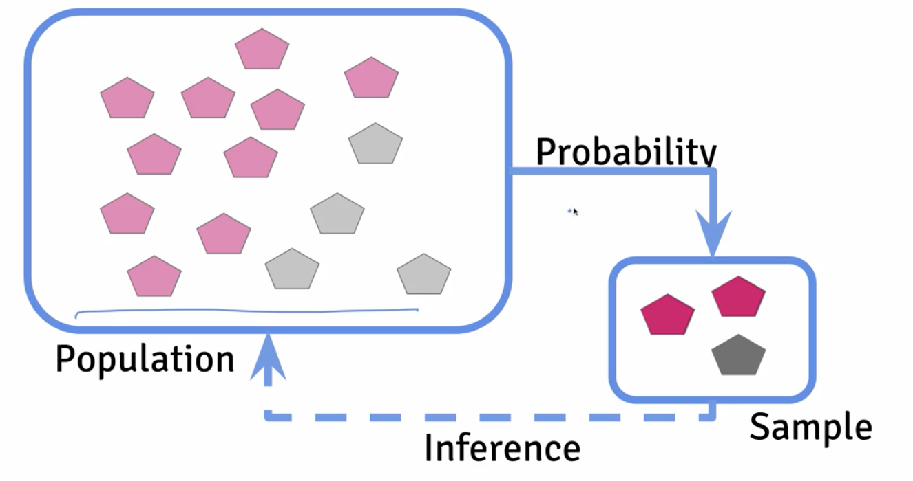

# Experimental Design: Variability, Replication, and Power

In genomic studies, researchers employ two distinct types of replicates to address different sources of variation and ensure robust experimental conclusions. Technical replicates involve repeated measurements of the same biological sample through identical laboratory procedures. For example, if you extract RNA from a single tissue sample and run it through sequencing multiple times, each run constitutes a technical replicate. These replicates are essential for assessing the reproducibility and precision of your experimental methodology - they reveal whether observed differences stem from actual biological phenomena or from inconsistencies in sample processing, instrumentation, or other technical factors. Multiple technical replicates help quantify measurement error and improve statistical confidence in your data. Biological replicates represent independent samples from different biological sources (different individuals, organisms, or tissue samples) that are processed using identical protocols. Each sample comes from a genetically and environmentally distinct source, capturing the inherent biological variation present in natural systems. For instance, collecting blood samples from five different patients and analyzing each separately yields five biological replicates. This type of replication is crucial because it allows researchers to distinguish between true biological differences and technical noise, enabling meaningful statistical inference about population-level phenomena. The distinction is critical: technical replicates assess experimental reliability, while biological replicates capture biological reality. Both are necessary for drawing valid conclusions about genomic patterns and their broader biological significance.

